# Diagrams

## Contract Architecture

Architecture of all smart contracts&#x20;

<figure>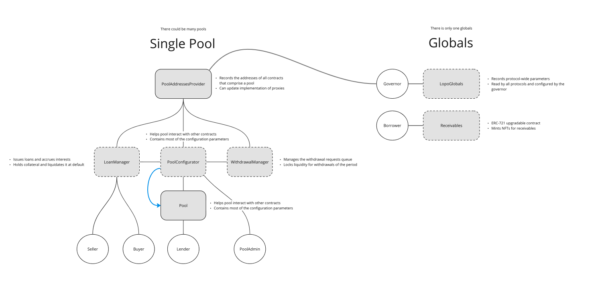<figcaption></figcaption></figure>

## Scenarios

A collection of scenarios to help you understand how Isle Finance works from end to end

### Borrowing

#### Seller mints receivables NFT

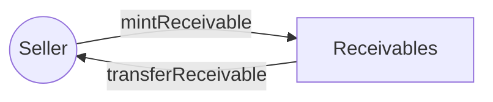

#### Buyer requests for a loan to be created for the receivable

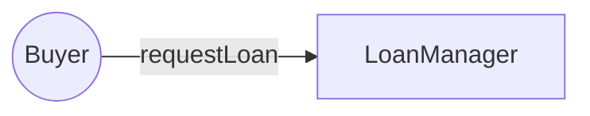

#### Pool Admin funds loan

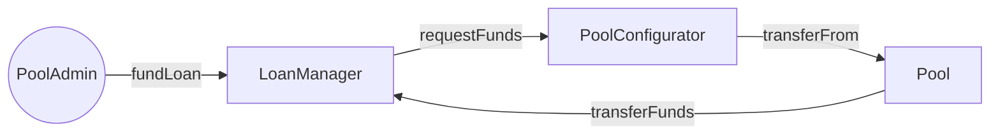

#### Seller withdraws funds by submitting the invoice

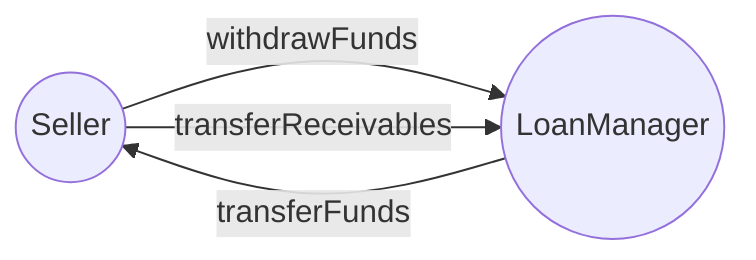

#### Buyer repays loan

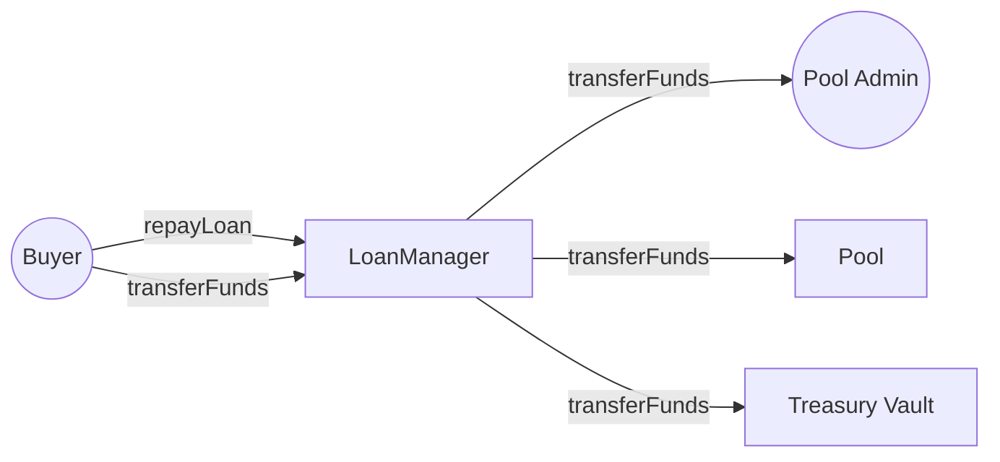

### Lending

#### Lender deposits funds

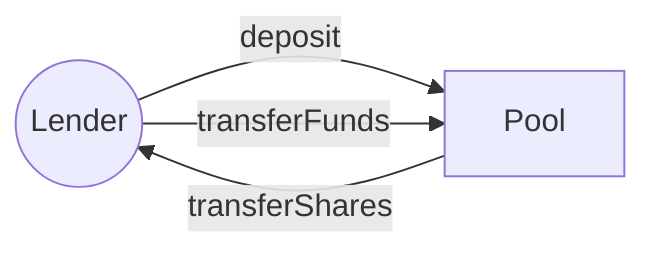

#### Lender requests redemption

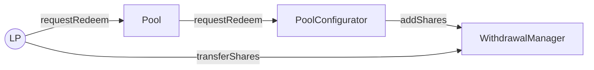

#### Lender redeems funds

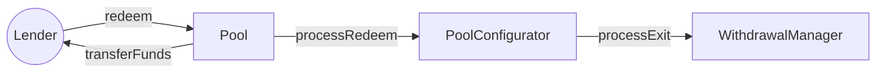

### Pool Configuration


There could be multiple sellers, but only a single buyer for a pool.


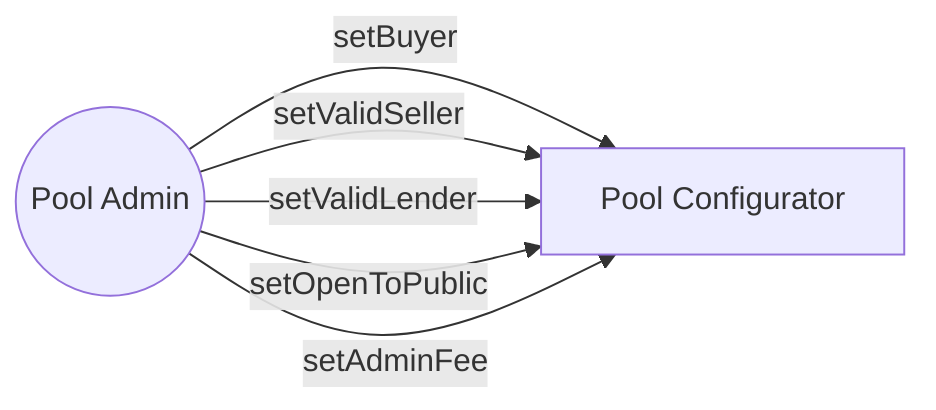

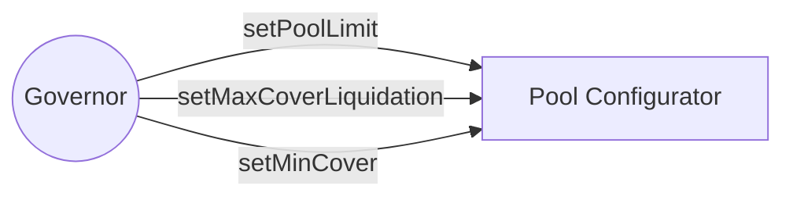
