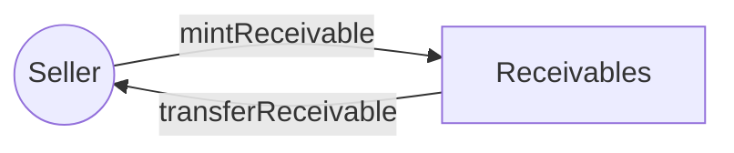
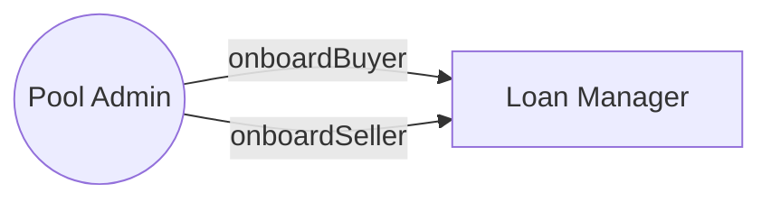
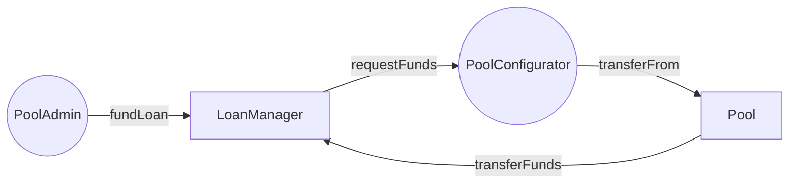
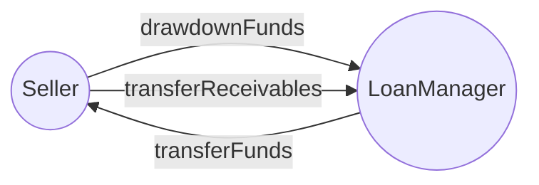
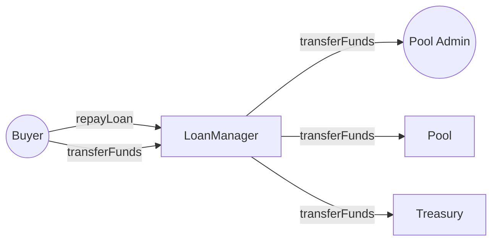
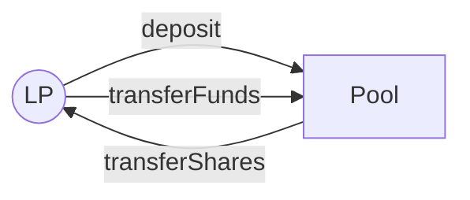
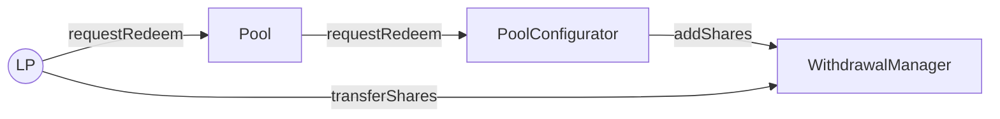
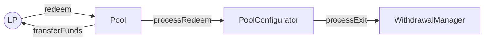

# Diagrams

## Contract Architecture

Architecture of all smart contracts&#x20;

<figure><figcaption></figcaption></figure>

## Scenarios

A collection of scenarios to help you understand how Lopo protocol works from end to end

### Seller mints receivables NFT

### Pool Admin onboards buyer and seller for its pool

### Buyer approves a loan to created for the receivable

### Pool Admin funds loan

### Seller withdraws funds

### Buyer repays loan

### LP deposits funds

### LP requests redeem

### LP redeems

